# File Inventory & Structure: KidaLookout Redesign

This document presents the folder structure, component list, and import hierarchies inside `D:\kidalookout`.

---

## 1. Directory Tree
```
d:\kidalookout\
├── app/
│   ├── favicon.ico          # Browser tab icon
│   ├── globals.css          # Light mode layout variables, typography scales
│   ├── layout.js            # Base HTML wrapper, loads Inter/Geist fonts
│   └── page.js              # Renders the 12 storytelling landing page components
├── components/
│   ├── AirportIntelligence.js  # Runway radar modal overlay
│   ├── Awards.js            # Monochromatic credentials list
│   ├── CTA.js               # Download action triggers (iOS / Android)
│   ├── DelayPrediction.js   # ATC slotting alerts and timelines
│   ├── FlightFriends.js     # Family status sharing dashboard
│   ├── FlightTracking.js    # Problem showcase: airline notification delays
│   ├── Footer.js            # Site directory links and legal disclosures
│   ├── Hero.js              # Constraints headline, 5-layer product stage
│   ├── ImportFlights.js     # Calendar sync and email parser wizard
│   ├── Navbar.js            # Floating pill navigation bar
│   ├── ScrollReveal.js      # Intersection-observer scroll reveal wrapper
│   └── Testimonials.js      # Star ratings and pilot quote cards
├── lib/
│   └── LenisProvider.js     # Global smooth scrolling provider
├── package.json             # Build configuration and dependency tree
└── next.config.mjs          # Next.js settings
```

---

## 2. Import Hierarchy Flow

```mermaid
graph TD
  Layout[app/layout.js] --> Lenis[lib/LenisProvider.js]
  Layout --> Globals[app/globals.css]
  
  Page[app/page.js] --> Navbar[components/Navbar.js]
  Page --> Hero[components/Hero.js]
  Page --> Problem[components/FlightTracking.js]
  Page --> Monitoring[components/ImportFlights.js]
  Page --> Alerts[components/DelayPrediction.js]
  Page --> Friends[components/FlightFriends.js]
  Page --> History[components/TravelHistory.js]
  Page --> Airports[components/AirportIntelligence.js]
  Page --> Trust[components/Awards.js]
  Page --> Testimonials[components/Testimonials.js]
  Page --> CTA[components/CTA.js]
  Page --> Footer[components/Footer.js]
  
  Hero --> ScrollReveal[components/ScrollReveal.js]
  Problem --> ScrollReveal
  Monitoring --> ScrollReveal
  Alerts --> ScrollReveal
  Friends --> ScrollReveal
  History --> ScrollReveal
  Airports --> ScrollReveal
  Trust --> ScrollReveal
  Testimonials --> ScrollReveal
  CTA --> ScrollReveal
```

